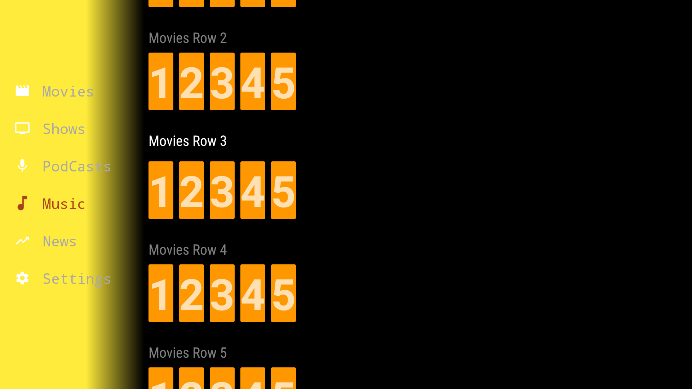
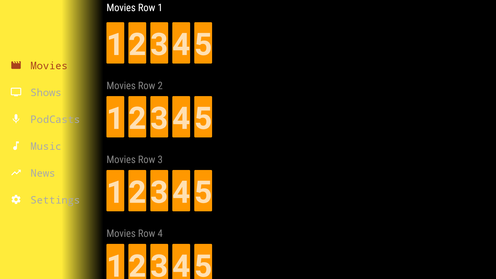

# TVNavigation
An Android TV navigation library inspired by Netflix.

As we all are aware of the limitations of Leanback Library. This is an effort in that direction to ease it.

A custom navigation implementation supported with RowsSupportFragment for Android TV.

I will be making this 100% dynamic[A Re-Usable Library] in coming weeks. But sharing it now with my fellow developers. 
Because I feel the Pain of Android TV Development :D
Also this is open for contribution so feel free to fork and send me a PR Cheers!!

